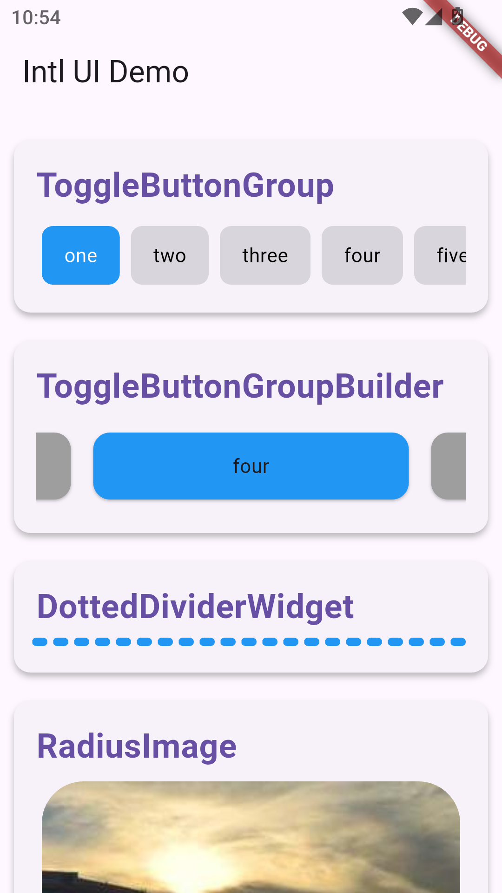
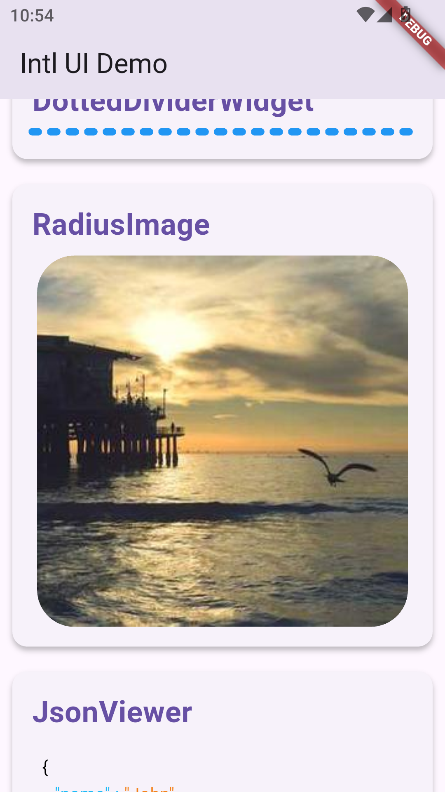
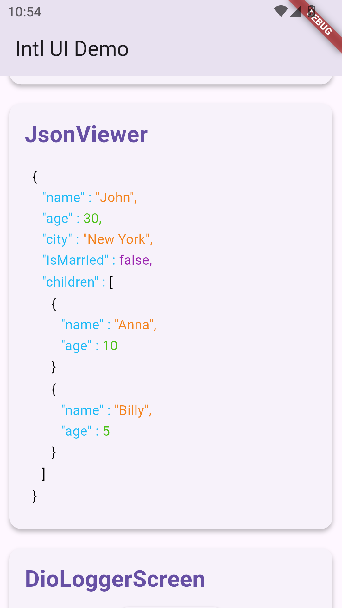
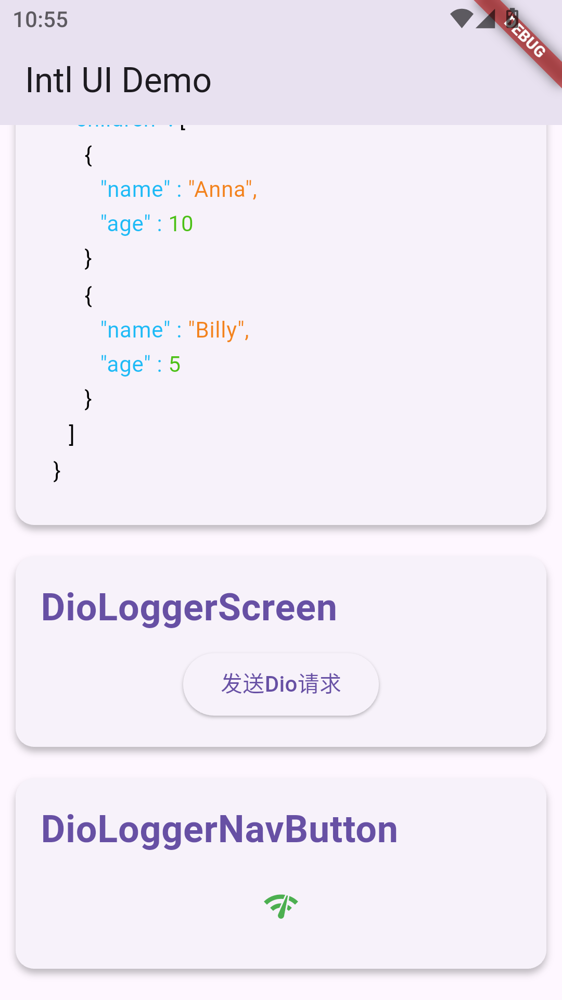
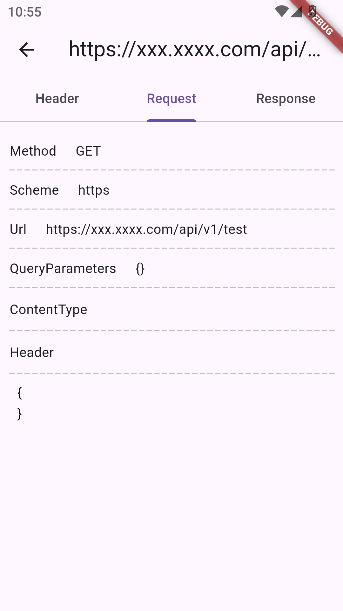

# Intl UI Components

|                                                |                                                |                                                |
|:-----------------------------------------------|:----------------------------------------------:|-----------------------------------------------:|
|  |  |  |
|  |  |  |  

---

## 🧩 组件列表

### 表单组件

#### 1. IntlDownButton

**功能**：国际化下拉按钮

```dart
IntlDownButton
(
text: 'Icon Text Button',
onPressed: () {},
)
```

#### 2. ToggleButtonGroup

**功能**：可滚动切换按钮组

```dart
ToggleButtonGroup
(
labels: ["one", "two", "three", "four", "five", "six"],
onSelected: (index) {},
)
```

---

### 布局组件

#### 1. IntlRow / IntlWrap

**功能**：智能流式布局

```dart
IntlRow
(
spacing: 8,
children: [/*...*/],
)

IntlWrap(
step: 3,
runSpacing: 12,
children:
[ /*...*/
]
,
)
```

#### 2. DottedDividerWidget

**功能**：多向虚线分割

```dart
DottedDividerWidget
(
color: Colors.blue,
strokeWidth: 6,
dashSpace:
10
,
)
```

---

### 展示组件

#### 1. UniversalCard

**功能**：超级卡片容器

```dart
UniversalCard
(
gradient: LinearGradient(/*...*/),
onPress: () => print('Card tapped'),
child: YourContent(
)
,
)
```

#### 2. RadiusImage

**功能**：智能圆形/圆角图片

```dart
RadiusImage
(
image: NetworkImage(url),
borderWidth:2,
)
```

#### 3. JsonViewer

**功能**：JSON 数据可视化

```dart
JsonViewer
(
jsonData
:
jsonDecode
(
jsonString
)
)
```

#### 4. DioLoggerScreen,

**功能**：Dio 日志查看器

```dart
///导航按钮
DioLoggerNavButton
(),

Dio dio = Dio();

///添加拦截器
dio.interceptors.add
(
DioLoggerInterceptors());
dio.get('https://xxx.xxxx.com/api/v1/test'
);
```

---

### 联系方式

- **QQ**：3496354336

